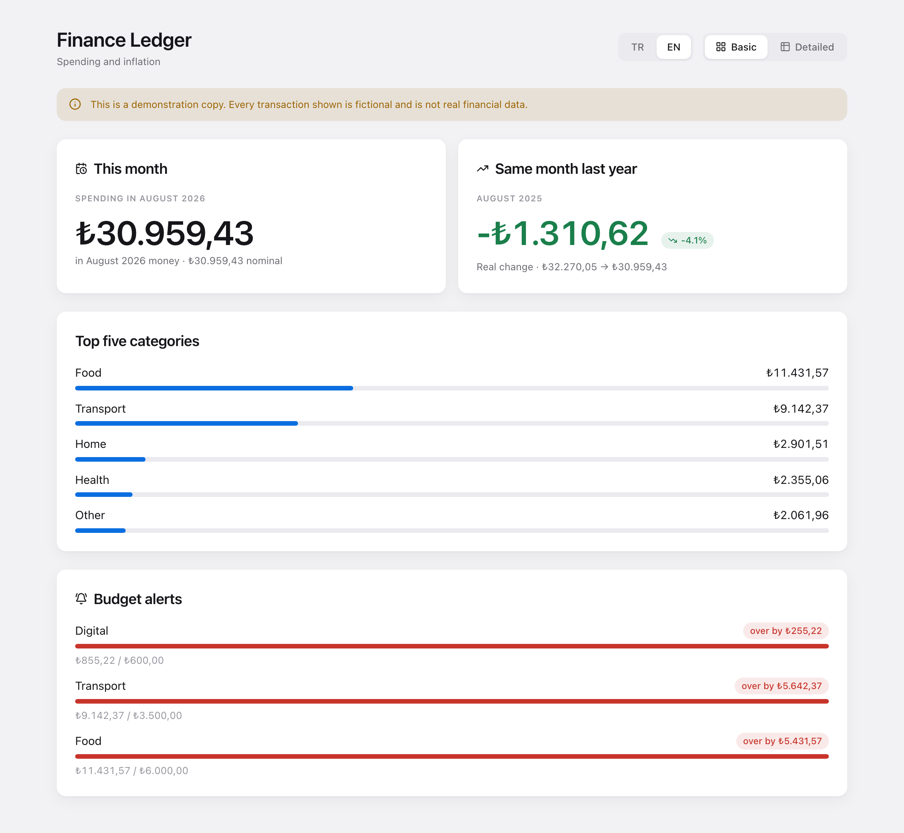
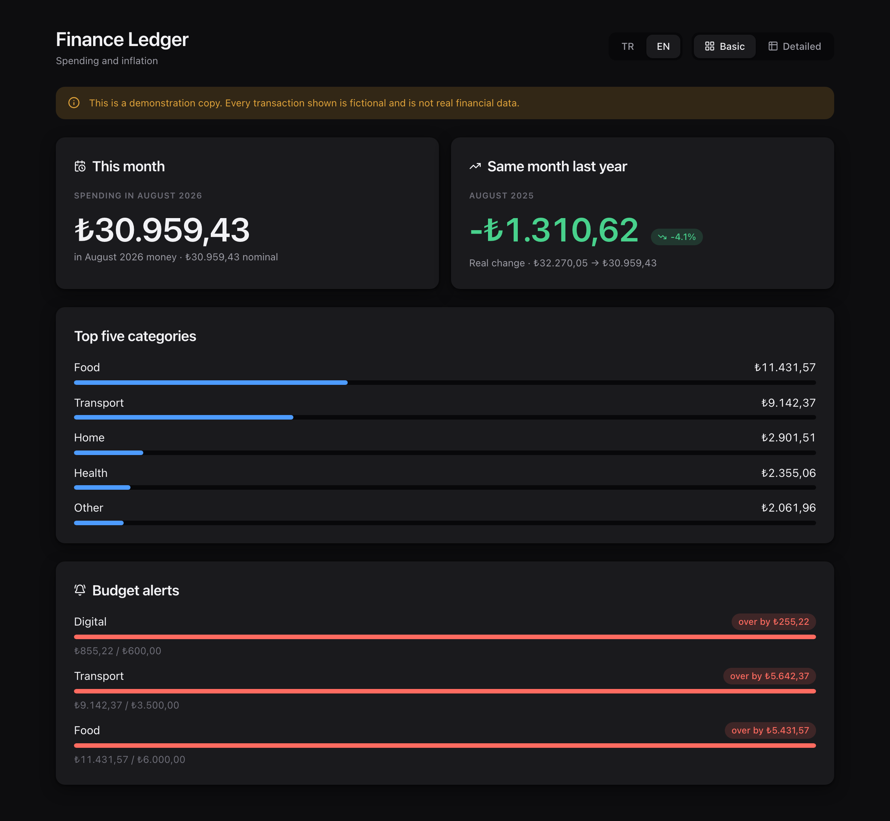
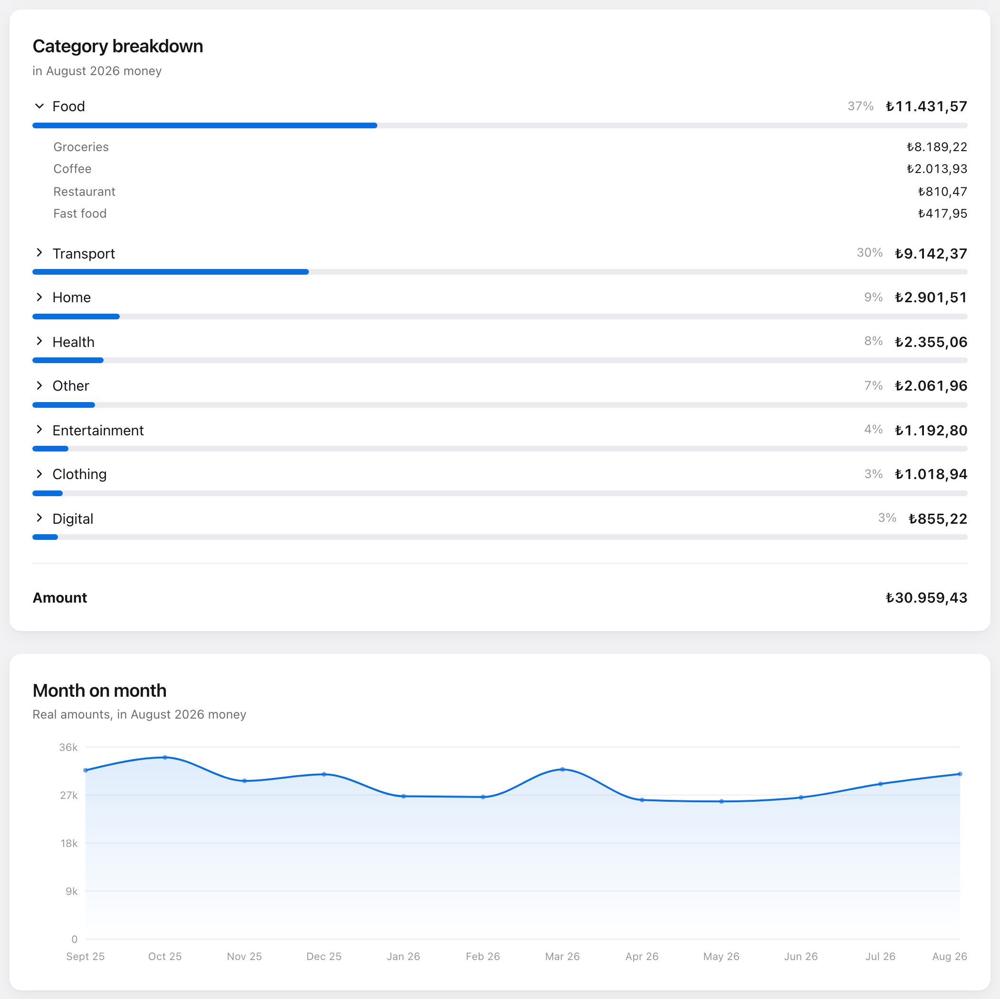
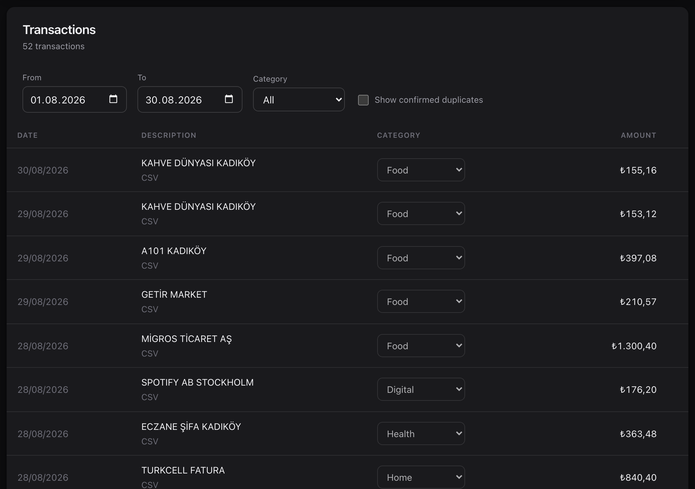

# Personal Finance Ledger

A self-hosted tool for understanding what you actually spend, built for Turkish credit
card statements and Turkish inflation.

It imports statements from PDF, works out which lines are the same purchase printed
twice, sorts spending into categories you control, and — the part that motivates the
whole thing — reports in **real terms**. In an economy running at thirty per cent a
year, comparing this March with last March in lira tells you almost nothing. Spending
₺30,959 this August against ₺24,540 a year ago looks like a 26% blowout; adjusted for
inflation it is a 4% *cut*. That second number is the one worth knowing, and it is what
this reports.

**[Live demo →](https://demo2.mariaftaieh.com)** — running on generated data, and read only.

Java 21, Spring Boot and PostgreSQL on the back; React and TypeScript on the front.
[SPEC.md](SPEC.md) is the brief it was built against.



*Every figure in these screenshots is generated demo data, which is why the
application says so across the top.*

---

## Quick start

Everything, database included:

```bash
docker compose up --build
node ledger-web/scripts/generate-demo-data.mjs   # optional: two years of demo data
```

The application is on `http://localhost:3000`, the API on `http://localhost:8080/api`.
Every port is overridable if those are taken:

```bash
LEDGER_WEB_PORT=3001 LEDGER_PORT=8090 LEDGER_DB_PORT=5433 docker compose up --build
```

The demo generator seeds invented transactions and the interface says so on screen.

If you put an instance on the public internet, turn on read-only mode — see
[below](#a-public-demo-has-no-business-accepting-writes):

```bash
LEDGER_DEMO_READ_ONLY=true docker compose up --build
```

The interface is available in English and Turkish, switchable in the header. Compose
builds it in English, since that suits a public demo; a self-hosted copy is more likely
to want Turkish:

```bash
LEDGER_LOCALE=tr docker compose up --build
```

---

## How it is put together

Four modules, and the boundary between the first two and the rest is the point:

| | |
|---|---|
| `ledger-core` | The domain. Money, the Turkish locale and parsing helpers, deduplication, the categorisation rule engine. **No dependencies at all.** |
| `ledger-import` | PDF text extraction, two bank adapters (Garanti BBVA, Yapı Kredi) and a CSV fallback. One dependency: PDFBox. |
| `ledger-app` | Spring Boot, PostgreSQL, Flyway, the REST API, the TCMB inflation client. |
| `ledger-web` | React, TypeScript, Vite, TanStack Query, Recharts. |

Maven Enforcer bans Spring, Spring Data, JPA and Hibernate from the two lower modules,
transitively, and CI runs the check on every push. `ledger-app` replaces that rule set
rather than adding to it, since it is the one module Spring belongs in.

The boundary earns its keep: the 141 tests in `ledger-core` need no network, no
database and no application context, and the money, locale, deduplication and
rule-engine logic they cover is exactly the code the web application runs.

Importing a file has four possible outcomes and the type system insists you handle all
of them:

```java
ImportResult result = new StatementImportService().importFile(bytes, "ekstre.pdf", null);

switch (result) {
  case ImportResult.Parsed p          -> store(p.statement());
  case ImportResult.NeedsPassword n   -> promptForPassword(n.fileName());
  case ImportResult.UnsupportedBank u -> offerCsvUpload(u.fileName());
  case ImportResult.Unreadable u      -> explain(u.reason());
}
```

---

## The API

| | |
|---|---|
| `POST /api/statements` | upload a PDF or CSV, optional `password` |
| `GET /api/statements` | what has been imported |
| `GET /api/transactions` | filters: `from`, `to`, `categoryId`, `includeConfirmedDuplicates` |
| `PUT` / `DELETE /api/transactions/{id}/category` | assign a category by hand, or drop the assignment |
| `GET /api/duplicates` | the review queue |
| `POST /api/duplicates/{id}/confirm` \| `/reject` | decide one |
| `GET /api/rules`, `POST`, `PUT /{id}`, `DELETE /{id}` | rule management |
| `GET /api/rules/preview` → `POST /api/rules/reevaluate` | how many rows would move, then move them |
| `GET /api/categories` | the two-level taxonomy |
| `GET /api/reports/monthly?month=&baseMonth=` | totals by category and subcategory, nominal and real |
| `GET /api/reports/year-over-year?month=&baseMonth=` | the same month a year apart, in real terms |
| `GET /api/cpi`, `POST /api/cpi/refresh` | the cached price index; extend it from TCMB |
| `GET /api/budgets`, `PUT` / `DELETE /{categoryId}` | monthly limits |
| `GET /api/alerts?month=` | budgets that were exceeded |

Uploading answers with a status rather than a bare error, because the outcomes need
different things from the user:

```
201 IMPORTED          { statementId, transactionsImported, suspectedDuplicates }
200 ALREADY_IMPORTED  the same bytes were uploaded before; nothing changed
422 NEEDS_PASSWORD    prompt, retry with the password
422 UNSUPPORTED_BANK  offer the CSV path
422 UNREADABLE        a scan, or not a statement at all
```

---

## The interface

Two views behind a single toggle in the header, which is the only navigation there is.

**Basic** answers "how am I doing" without a click: this month in real terms, the same
month last year, the top five categories, and any budget alert. Note the year-on-year
figure — spending fell 4% in real terms, so it reads green, even though it is a negative
number.

English and Turkish are both available, and the toggle sits next to the view switch.



**Detailed** is the working surface: statement upload, a period selector, the category
breakdown drilling down to subcategory, twelve months of real-terms trend, the
transaction table with filters and manual categorisation, the duplicate review queue,
and rule management.



The trend line is close to flat while the nominal amounts behind it rose by a quarter.
That gap is the entire reason this exists.



Light and dark both come from the same custom properties following
`prefers-color-scheme`; there is no theme switch to forget to use.

---

## Design notes

The decisions worth explaining, and why they went the way they did.

### Money is a type, not a `double`

`0.1` has no exact binary representation, so a price held in a `double` is wrong before
any arithmetic happens and the error compounds with every addition. `MoneyPrecisionTest`
puts the two side by side: `Money` adds a hundred ten-kuruş items to exactly ₺10.00, the
`double` does not.

`Money` wraps a `BigDecimal` and a `Currency`, fixes the scale at 2 in its canonical
constructor — so `1.5` and `1.50` are one value and the record's generated `equals`
behaves the way a reader expects — and throws on cross-currency arithmetic rather than
coercing. Rounding is `HALF_UP`, because that is what the statement in the user's hand
did.

It crosses the JSON boundary as a *string*. A JSON number becomes a JavaScript double in
the browser and throws away the precision the backend just spent effort protecting.

### Turkish is a hostile locale, and the JVM will not warn you

Turkish pairs its four i letters as `i↔İ` and `ı↔I`, unlike every other locale. On a
machine whose default locale is `tr-TR` — the likely machine for this application —
`"TITLE".toLowerCase()` returns `"tıtle"`, and every string comparison written with the
no-argument overload silently stops matching. Nothing throws. It just quietly finds
nothing.

So the split is absolute: matching logic folds with `Locale.ROOT`, display folds with
`tr-TR`. `TurkishTextTest` asserts the bug is real, and `RuleEngineTest` sets the default
locale to `tr-TR` and checks the rule engine still categorises correctly.

Three more traps in the same family:

- **Numbers.** Statements print `1.234,56`. `new BigDecimal("1.234")` succeeds and is
  wrong by a factor of a thousand, so amounts go through an explicit `DecimalFormat`
  that must consume the whole string.
- **Dates.** `dd.MM.yyyy`, `dd/MM/yyyy`, and abbreviated Turkish months like `05 Oca 2026`.
  Month names resolve through a table this project owns rather than JDK CLDR data, which
  moves between releases and does not always spell things the way a bank does.
- **Encoding.** Extracted text is NFC-normalised at the extraction boundary so a composed
  `ş` and a decomposed one compare equal, with a separate fold-to-ASCII used only for
  matching and never for storage.

### The bank's text is sacred; everything else is derived

`rawDescription` is stored exactly as printed and never touched. The normalised form, the
deduplication comparison and the assigned category are all recomputed from it. That is
what makes it possible to improve the normaliser or the rule set later and reprocess
years of history without asking anyone to re-upload anything.

### Deduplication, and the two coffees on a Tuesday

Consecutive statements share the days between one period's end and the next one's start,
so those purchases are printed twice. The constraint that shapes the entire algorithm is
that **two identical purchases on the same day are legitimate**. Two coffees from the same
shop at the same price is an ordinary morning, and a unique constraint on
`(date, amount, description)` would erase one of them permanently.

So deduplication runs only *between* statements, never within one, and it is a pairing
problem rather than a uniqueness problem. Each line in the later statement claims at most
one unclaimed line in the earlier one, which leaves `n + m - min(n, m) = max(n, m)` — the
larger of the two accounts of the same days. Three overlapping statements of one purchase
still collapse to one, because a claim is scoped to the statement making it.

Candidates must match **exactly** on date, amount and currency. The sign is part of the
amount, so a refund never lands in the same bucket as the charge it reverses. Only then
are descriptions compared, with token-set Jaccard above 0.60 — chosen against the corpus,
where a repeat that drifts by one token scores 0.67 and two unrelated merchants sharing a
generic word score 0.33 — plus a narrow prefix rule for the one difference a set measure
cannot see: a description truncated at two different column widths.

**Nothing is deleted.** The later occurrence is flagged with its score and the reason, and
a person confirms or rejects it. A tool that silently drops rows is not one you can trust
with the rows it kept.

One consequence worth knowing: the pass compares any two statements whose periods
overlap, including statements from different banks. An instalment charged to two cards on
the same day for the same amount will be flagged. That is the right default — it is far
more often one purchase seen twice than two identical ones — and it is exactly why the
outcome is a queue rather than a merge.

### The fingerprint is not the deduplication key

Re-uploading the same file should be a no-op, which suggests a unique constraint on some
computed fingerprint. Done naively that collides head-on with the rule above: a
fingerprint over `(date, amount, description)` rejects the second coffee.

The two reconcile once the fingerprint identifies **a row of a document** rather than a
purchase. It hashes the statement's own content hash, the row's values, and an occurrence
number counting identical rows within that file. The same bytes always produce the same
fingerprints, so a re-upload is idempotent; two identical lines in one file get different
ones, so both survive.

Recognising the same purchase across two *different* documents is a separate problem with
a separate answer — scored, reviewable, and deliberately not a database constraint. A
unique index cannot express "probably the same thing, ask the user", and a finance tool
needs to be able to say that.

The statement's SHA-256 is checked before the parser runs, so an identical re-upload costs
one indexed query rather than a full parse.

### Categorisation: first match wins, and the user always wins

Rules are sorted by priority, then id, and the first match decides. Letting every matching
rule contribute produces totals that do not add up — a coffee that is both "Kahve" and
"Restoran" would be counted twice and the monthly total would exceed what was actually
spent. One transaction, one category.

Nothing reserves a priority band for the sixty-four seeded rules. A user rule can take
priority 1 and outrank all of them, because overriding a bad guess is the thing people
most want to do and a partitioned priority space makes it impossible.

A category set by hand is stored as an override flag, not as a new rule. Inventing a rule
from one correction would silently recategorise everything that happens to look similar.
The flag is what makes a manual assignment survive a bulk re-evaluation.

That bulk re-evaluation is deliberately two calls, `preview` then `reevaluate`: editing one
rule can reshape a year of history, and a number to look at first is the difference between
a deliberate change and an accident.

Anything no rule matches lands in a seeded "Diğer → Sınıflandırılmamış", and card fees,
interest and instalment restructuring are routed to "Finansal" so they never masquerade as
spending.

User-authored regular expressions get two defences: a complexity budget at save time that
refuses a quantifier nested inside a quantified group, and a step budget at match time
implemented as a `CharSequence` that counts reads and gives up. Java's regex engine has no
timeout of its own, and a wedged thread with no error is far harder to diagnose than a
rejected rule.

### Reading a table out of a PDF

`PDFTextStripper.getText()` flattens a table into a stream of words whose column is no
longer recoverable — the amount and the instalment count come out adjacent and
indistinguishable. Keeping the x coordinate lets each column be derived from the header
row: a column starts where its header label starts and runs until the next one begins.
Anchoring on the left edge rather than the midpoint between labels is what lets a
200-point description column live under the single word "Açıklama".

Two bank adapters, not ten. Two is enough to prove the abstraction is real, and the
layouts differ in every way that matters: five columns against three, `dd.MM.yyyy` against
`05 Oca 2026`, a separate posting-date column against none, and a trailing minus for
refunds against a leading one. The CSV importer exists because some banks only export CSV,
and because it gives people a path when their bank is unsupported.

### Real spending uses the index level, not the annual rate

This is the easy mistake, because the annual rate is the number in the news. It answers a
different question. Year-on-year inflation to January 2026 was 30.65%, so adding 30.65% to
a January 2024 amount gives ₺1,306.50 — but two years of compounding actually put it at
₺1,856.75, which is what the ratio of the two months' index *levels* gives. No single
annual percentage can carry that.

```
real = nominal × (CPI_base / CPI_transactionMonth)
```

`PriceIndexTest` asserts both numbers side by side, so the difference is not something you
have to take on trust.

### Verifying TCMB's service instead of trusting the documentation

The instruction was to curl the service before writing a line of client code rather than
trust any document. That turned out to matter twice.

**The endpoint.** `evds2.tcmb.gov.tr/service/evds/?key=…` answers `302` to
`https://evds3.tcmb.gov.tr/`, and every path under that host — `/service/evds/`, `/api/`,
anything at all — returns the same 1,355-byte single-page-app shell with `200 OK`. A client
written from any pre-2026 snippet therefore gets a *successful* response containing HTML
and no data, which is a far nastier failure than a 404. The real service was found by
reading the EVDS web application's own JavaScript bundle, which sets
`axios.defaults.baseURL = "/igmevdsms-dis"` and posts to `/fe` for series data:

```
POST https://evds3.tcmb.gov.tr/igmevdsms-dis/fe
{"type":"json","series":"TP.GENENDEKS.T1","startDate":"01-01-2026","endDate":"30-09-2026",
 "frequency":"5","decimalSeperator":".", …}

→ {"totalCount":8,"items":[{"Tarih":"01-2026","TP_GENENDEKS_T1":"3683.83"}, …]}
```

The series is named in the response by its own code with dots turned into underscores, and
only published months come back — there is no null padding out to the requested end date.

**The series.** The obvious choice, `TP.FG.J0`, still returns the CPI general index but
stops at January 2026: TÜİK rebased and it is now an archive series. `TP.GENENDEKS.T1`
carries identical figures — all 277 overlapping months agree exactly — and continues to the
latest release. It is configurable via `ledger.evds.series-code`.

**TLS.** TCMB's configuration was supposed to be too old for the JDK's defaults. Measured,
the handshake negotiates TLSv1.2 with `TLS_ECDHE_RSA_WITH_AES_128_GCM_SHA256` and the
default `HttpClient` accepts it, so no custom `SSLContext` is configured — there was
nothing to fix. Certificate validation is never disabled, and if that day comes the fix is
an explicit context, not a trust-everything one.

**The key.** The endpoint currently serves this series with no credential at all.
`EVDS_API_KEY` is still sent when present, as a header and never as a query parameter, so a
future requirement is a configuration change rather than a code change.

### Offline first, because a report is not a network call

Reports never touch TCMB. They read a local table that Flyway fills from a checked-in CSV
of 284 published months, 2003-01 to 2026-08. That is what makes the demo work on a train,
the integration tests hermetic, and a TCMB outage a non-event. `POST /api/cpi/refresh` is
the only thing that ever reaches out, and it degrades to `reached: false` rather than an
error status, because the application is still perfectly functional when TCMB is not.

The refresh window starts at the latest month already cached rather than the one after it.
Re-reading that single month is what makes a TÜİK revision visible: the stored value and
its fetch timestamp are compared against a fresh reading, and a disagreement is logged as a
revision rather than silently overwriting history.

### The current month is nominal, and says so

CPI is published in the first days of the following month, so the current month never has
one. Nothing is extrapolated. Every figure carries an `adjusted` flag, and a month with no
published index comes back with `real` equal to `nominal` and `adjusted: false`, so the
interface can label it rather than presenting an unadjusted number as though it were
comparable.

Every figure also carries its `baseMonth`. "₺6,200 in today's money" is meaningless without
saying which month is today, so the base travels with the number instead of sitting in a
field further up the response.

### Budgets are measured in nominal money

Alerts compare nominal spending against the limit, not real. A budget is a decision about
the money that will actually leave the account this month, so deflating either side would
answer a question nobody asked. Real terms are for comparing months to each other, which is
what the reports are for.

Alerts are evaluated on write — after an import and after a bulk recategorisation, since
both change what a category holds — and an alert clears when a category comes back under
its limit, because one that outlives the overspend is worse than none.

### What the frontend is not allowed to do

It never does arithmetic on money. Every total, every deflated figure and every difference
arrives already computed in `BigDecimal` on the server, and amounts cross the wire as
strings precisely so they never become doubles on the way. The one place a number is parsed
is chart geometry, where the unit is a pixel — and that function says so in a comment.

Formatting goes through `Intl.NumberFormat`, handed the decimal *string* rather than a
parsed number: `Intl` formats a string exactly, so the value does not pass through a float
even to be displayed. Strings live in a small typed dictionary whose keys are derived from
the Turkish one, so a translation missing from English is a compile error rather than a
blank label.

Language is resolved once at module load — a stored choice, then the build default — and
switching reloads the page rather than re-rendering. The locale is threaded through `Intl`
formatters built and cached at the same time, and making it reactive would mean a context,
a provider and cache invalidation to save one page load on something a person does
approximately never.

Currency is the exception to following the interface language: amounts stay Turkish
whatever the prose is doing. They are lira, they came off a Turkish statement, and
`₺30.959,43` is how they are written — the same reasoning as rounding HALF_UP, that a
figure the reader can check against the paper in their hand beats one that matches the
words around it. Dates and percentages do follow the language.

Category names are data rather than interface strings: they are seeded in Turkish and a
user can add their own. English display names are supplied for the ids that ship with the
application, and anything else falls back to the name the API returns.

### Restraint is a design decision, not an absence of one

Depth comes from soft shadow and a shift in background tone rather than from strokes;
hairlines at low opacity are the only lines; a 12px radius is used consistently; there is
one accent colour, and semantic colour is reserved for meaning. Numbers are set in
`tabular-nums` everywhere — in a finance table, columns that line up matter more than any
other typographic choice. Light and dark come from the same custom properties following
`prefers-color-scheme`, and every transition collapses to 1ms under
`prefers-reduced-motion`.

Semantic colour needed more care than a rule about signs. The year-on-year headline is a
negative number when spending has *fallen* in real terms, which is the good outcome, so it
is green — while a refund, also negative, is red. Colour follows what a figure means, not
whether it has a minus in front of it.

### A public demo has no business accepting writes

The application is single user and has no authentication. That is fine on a machine only
its owner can reach and completely wrong on the open internet, where the deployed demo
lives. Rather than bolt on half an authentication system, `LEDGER_DEMO_READ_ONLY=true`
makes the deployment safe to expose: everything can be read, nothing can be changed.

The reason is not tidiness. Somebody will eventually drop a **real bank statement** onto a
public URL to see what happens. Without this, that file would be parsed and persisted into
the one shared database — and then shown to every other visitor. That is a privacy leak,
and it is a much worse outcome than a demo whose numbers drift.

So uploads are handled specially. The parser still runs and still reports honestly what it
found, because watching it read a statement is the most interesting thing anyone can do
with the demo — and then the result is discarded. The response says `PARSED_NOT_STORED`
and the interface says the same in words. Nothing reaches the database.

Everything else is refused with a 403 at the edge, in one servlet filter over the HTTP
method, rather than as a check inside each service. A rule that covers every endpoint
including ones added later is worth more than a scattering of assertions somebody will
forget to add: a new controller method would simply be unprotected, and nobody would find
out until it was used. The browser also disables the controls it knows cannot work, but
that is only an affordance — the server refuses regardless of what the client believes.

### The demo data has to make the argument

The generator runs for twenty-four months rather than twelve, because the headline feature
compares a month with the same month a year earlier and one year gives nothing to compare
against. Nominal amounts drift upward at roughly the rate Turkish prices actually moved, so
the demo shows nominal spending climbing 26% year on year while real spending falls 4% —
which is the entire point of the application. A demo with flat amounts would have
demonstrated the opposite of the thing it exists to demonstrate.

---

## Development

Java 21 or newer and Maven 3.9+:

```bash
mvn verify
```

That runs the module boundary check, the unit, property-based and integration tests, the
`google-java-format` check and SpotBugs. `mvn spotless:apply` fixes formatting.

The frontend:

```bash
cd ledger-web
npm install
npm run dev        # http://localhost:5173, /api proxied to :8080
npm run typecheck && npm run lint && npm run build
```

Against your own PostgreSQL instead of Compose:

```bash
LEDGER_DB_URL=jdbc:postgresql://localhost:5432/ledger \
LEDGER_DB_USER=ledger LEDGER_DB_PASSWORD=ledger \
mvn -pl ledger-app spring-boot:run
```

### Testing

225 tests: 141 in `ledger-core`, 29 in `ledger-import`, 55 in `ledger-app`. Unit tests and
`@ParameterizedTest` tables for the money, date and number parsing; jqwik property tests
for the deduplication invariants (deduplicating a statement against itself is a no-op;
merging A then B equals merging B then A); Testcontainers against a real PostgreSQL image;
and `@WebMvcTest` for the HTTP contract.

**Testcontainers, not H2.** H2 would accept most of the schema and quietly ignore the parts
that matter: the partial index on the review queue, `numeric(19, 4)`, the check constraints
that keep an instalment's two columns in step, `gen_random_uuid()` in the seed. The
migrations *are* a large part of this application, so testing them against anything but
PostgreSQL would be testing something else.

One container is shared by the whole suite, started once and never stopped, with Spring's
context cache keeping the application context alive alongside it. The obvious-looking
alternative — JUnit's `@Container` on a static field in a shared base class — stops the
container after *each* subclass while the cached context keeps its connection pool, and
every test in the second class then dies on a dead port after a long timeout.

Those tests need a Docker daemon and **skip themselves** when there is none, so a green
local build on a machine without Docker has not run them. CI checks for Docker before the
build and fails if anything was skipped, so they cannot pass unnoticed there.

---

## A note on the data

No real statement has ever been in this repository, and the tooling is set up to keep it
that way. Every fixture is synthetic and produced by a committed generator, so the corpus
can be rebuilt or extended without anyone needing a real PDF:

```bash
mvn install -DskipTests
mvn -pl ledger-import org.codehaus.mojo:exec-maven-plugin:3.1.0:java \
    -Dexec.mainClass=dev.ledger.imports.fixtures.FixtureGenerator \
    -Dexec.classpathScope=test \
    -Dexec.args=ledger-import/src/test/resources/fixtures
```

A pre-commit hook rejects any staged PDF outside that fixture directory
(`git config core.hooksPath .githooks`, already set). `.gitignore` covers `*.pdf`, `data/`
and `.env`.

If you ever do redact a real statement, verify it by extracting the text rather than
looking at the rendered page. Black rectangles drawn over a PDF do not remove the text
layer underneath them.

---

## Licence

[MIT](LICENSE).
